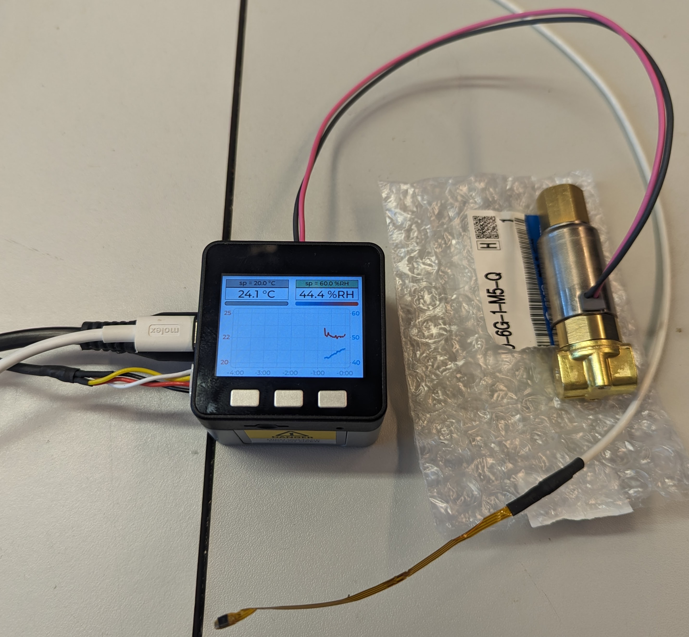

# DualPID
Dual channel PID regulator. Each channel is (compile time) configurable to read out a sensor and control an output (on/off or H-Bridge). It could for example be used for:
 * Temperature and/or Humidity control (Incubator or Grow box)
 * Reflow Oven (either use one channel or two 'zones')

Currently used for controlling both temperature and humidity but should be versatile enough to control any two things from different sensors. The general design goals are:
 * [x] Least work hardware: Use existing, easily buyable parts like M5Stack.
 * [x] Two channel PID with
   * [x] Lock detection
   * [x] Linear forward term 
   * [x] Derivative-on-measurement
   * [x] Intergral windup prevention
   * [x] On-Device editable PID settings
   * [x] Input and/or D-term filter
   * [ ] Take-back-half
 * [x] Two H-Bridge outputs able to control most things from heaters, peltiers, valves etc
 * [x] Multiple sensors: Temperature, Humidity, Co2. Currently Supports:
   * [x] SHT30/31/35 Temperature+Humidity sensor
   * [x] K5Meter with intergrated MAX31855 Thermocouple sensor
   * [x] SprintIR Co2 sensor
   * [ ] more to come..
 * [x] Adjustable time intervals per channel (100ms - minutes)
 * [ ] run-time configurable
 * [x] Error graphs
 * [ ] Remote logging (csv, mqtt or other)

## Hardware
Start with [M5Stack Cushion, mandatory lab equipment](https://shop.m5stack.com/collections/m5-accessory/products/m5stack-cushion)

### Base
 * [M5Stack Core](https://shop.m5stack.com/collections/m5-core/products/basic-core-iot-development-kit)

### Backplane (optional)
 * [M5Stack AC Power Base](https://shop.m5stack.com/products/m5stack-ac-power-base) or
 * [M5Stack Din rail + LDO backplane (26mm)](https://shop.m5stack.com/products/base-26proto-industrial-board-module) or
 * [M5Stack Din rail + LDO backplane (15mm)](https://shop.m5stack.com/products/base15-proto-industrial-board-module)
 * [Power Supply](https://nl.farnell.com/xp-power/vel12us120-eu-ja/adaptor-ac-dc-12v-1a/dp/2524421)

### Sensor
 * [x] [SHT31-D breakout board](https://www.adafruit.com/product/2857)
 * [x] [M5 Kmeter Isolation Unit with Thermocouple Temperature Sensor (MAX31855)](https://shop.m5stack.com/collections/m5-sensor/products/kmeter-isolation-unit-with-thermocouple-temperature-sensor-max31855)
 * [x] [SprintIR CO2 sensors](https://www.co2meter.com/products/sprintir-wr-20-pct-co2-sensor)
 * [ ] [MCP9600 Thermocouple Amplifier](https://www.adafruit.com/product/4101)
 * [ ] [DS18B20 1-Wire thermometer variants](https://www.analog.com/media/en/technical-documentation/data-sheets/ds18b20.pdf)
 * [ ] [MAX31856 Precision Thermocouple to Digital Converter](https://www.analog.com/media/en/technical-documentation/data-sheets/MAX31856.pdf)
 * [ ] [M5 Temperature Humidity Air Pressure Sensor (SHT40+BMP280)](https://shop.m5stack.com/products/env-iv-unit-with-temperature-humidity-air-pressure-sensor-sht40-bmp280?mc_cid=4195edd3e8&mc_eid=9d94b48854)
 * [ ] [M5 ENV III Unit with Temperature Humidity Air Pressure Sensor (SHT30+QMP6988)](https://shop.m5stack.com/collections/m5-sensor/products/env-iii-unit-with-temperature-humidity-air-pressure-sensor-sht30-qmp6988)
 * [ ] [M5 CO2 Unit with Temperature and humidity Sensor (SCD40)](https://shop.m5stack.com/collections/m5-sensor/products/co2-unit-with-temperature-and-humidity-sensor-scd40)
 * [ ] [M5 CO2L Unit with Temperature and Humidity Sensor (SCD41)](https://shop.m5stack.com/collections/m5-sensor/products/co2l-unit-with-temperature-and-humidity-sensor-scd41)

### Output Drivers
 * [x] TIP132 solution (see /Pictures), Simple On/Off regulator
 * [ ] [M5 H-bridge Unit v1.1](https://shop.m5stack.com/collections/m5-sensor/products/h-bridge-unit-v1-1-stm32f030)
 * [x] [Mini 3A Relay Unit](https://shop.m5stack.com/products/mini-3a-relay-unit)
 * [x] [M5 2-Channel SPST Relay Unit](https://shop.m5stack.com/collections/m5-sensor/products/2-channel-spst-relay-unit)
 * [x] [M5 4-Relay Unit](https://shop.m5stack.com/collections/m5-sensor/products/4-relay-unit)
 * [ ] [Single-phase DC SSR Unit (RS485)](https://shop.m5stack.com/collections/m5-sensor/products/single-phase-dc-ssr-unit-cdg1-1dd-10a)
 * [ ] [M5 Solid State Relay Unit](https://shop.m5stack.com/products/solid-state-relay-unit-bt136s)
 * [ ] [M5 Single-phase AC SSR Unit](https://shop.m5stack.com/products/single-phase-ac-ssr-unit-cdg1-1da-10a)

### Ideas which could be added/supported/implemented:
 * [ ] [Core2 with touch interface](https://shop.m5stack.com/products/m5stack-core2-esp32-iot-development-kit)
 * [ ] [4Ch Lego Motor module](https://shop.m5stack.com/collections/m5-module/products/lego-module)
 * [ ] [3Ch Stepmotor module](https://shop.m5stack.com/products/stepmotor-module-with-mega328p-drv8825)
 * [ ] [Base+4x Lego Motor Module](https://shop.m5stack.com/products/basex)
 * [ ] [Fan for motor module](https://shop.m5stack.com/collections/m5-module/products/fan-module-for-stepmotor)
 * [ ] [H-Bridge Unit](https://shop.m5stack.com/products/h-bridge-unitstm32f030)
 * [ ] [M5 Tube/Air Pressure Unit](https://shop.m5stack.com/collections/m5-sensor/products/tube-air-pressure-unit)
 * [ ] [M5 Voltmeter Unit (ADS1115)](https://shop.m5stack.com/collections/m5-sensor/products/voltmeter-unit-ads1115)

 ## Dependencies
 * My fork of MiniPID: [FPID](https://github.com/knifter/FPID)
 * Temp/Hum sensor: [lib-SHT35](https://github.com/knifter/lib-SHT3x)
   * Uses my I2C Device library wrapper: [lib-TwoWireDevice](https://github.com/knifter/lib-TwoWireDevice)
 * my GUI framework: [lib-soogh](https://github.com/knifter/lib-soogh)
   * Uses [LVGL](https://github.com/lvgl)
   * Uses [LovyanGFX](https://github.com/lovyan03/LovyanGFX)
 * my tools library [lib-tools](https://github.com/knifter/lib-Tools)

## Credits
Originally this design was based upon https://github.com/sciunto-org/humidity_regulator, an arduino sketch for an Ardiuno Uno. But since I've replaced even the PID loop library, I don't think there is much left of that design. But the idea came from them so credit where credit is due ;)

They (sciunto) quoted this paper as well, I will too:
F. Boulogne, "Cheap and versatile humidity regulator for environmentally controlled experiments", The European Physical Journal E, vol. 42, no. 4, 2019, pp. 51.
* EPJE: <https://doi.org/10.1140/epje/i2019-11813-0>
* On arxiv: <https://arxiv.org/abs/1903.08952>

The user interface is build with the Light Weight Versatile Graphics library: [LVGL](https://github.com/lvgl/lvgl)
The screen library is written by lovyan03, [LovyanGFX](https://github.com/lovyan03/LovyanGFX)
